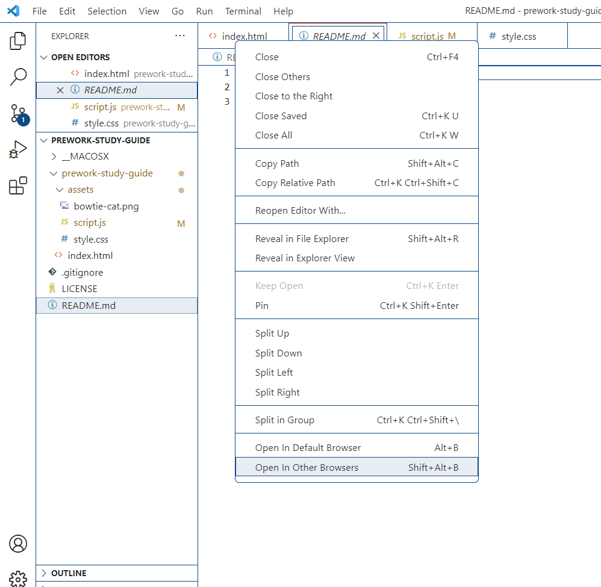
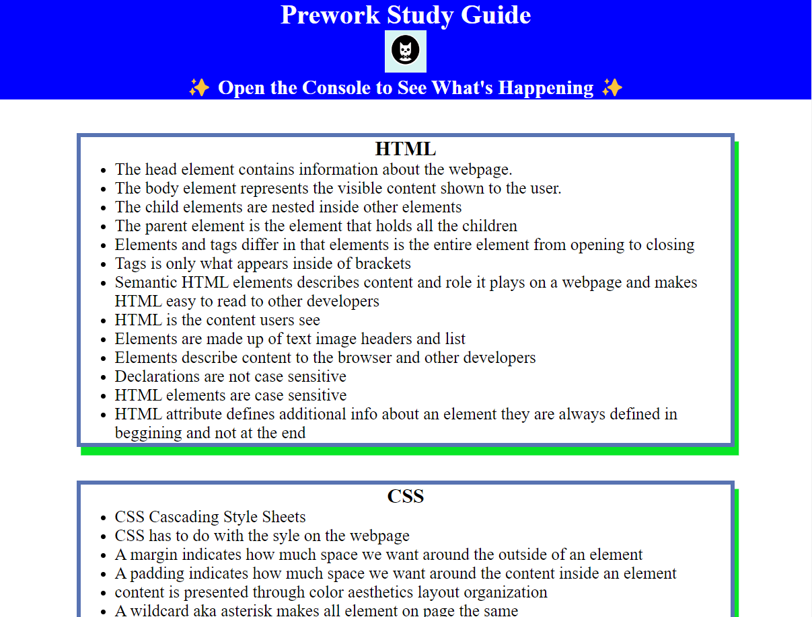
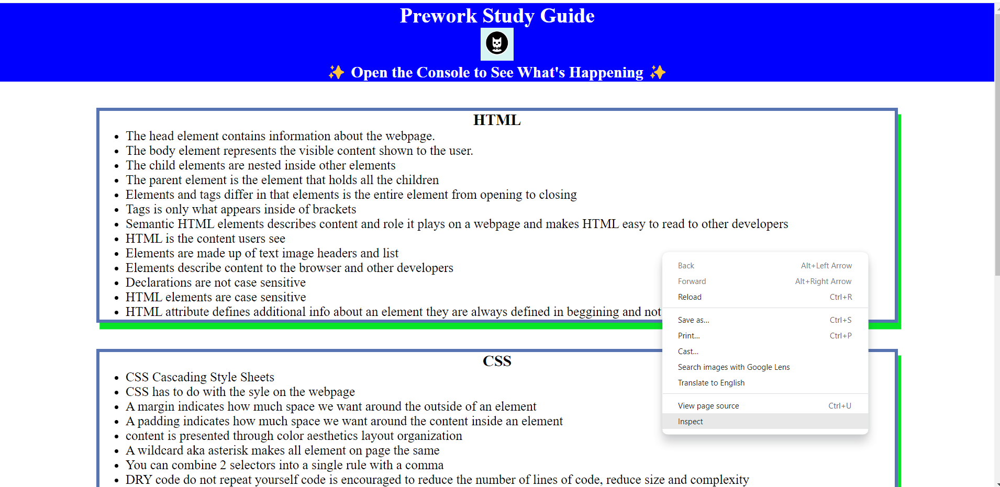
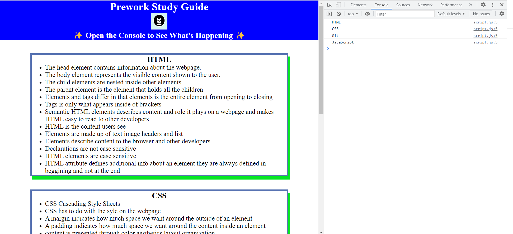

# Ben's Prework Study Guide

## Description

To get a head start on being introduced to the basics of CSS, HTML, and Javascript Rutgers sent the students a prework study guide to work on and to practice our skills.  I built this project to help myself, friends, and fellow students understand the basics of these three coding languages.  Working on this project helped me in a lot of ways because I had no idea any of the terminology of these languages.  It helped me get introduced and work hands on with the types of things I was reading and being taught through the modules.  I learned how to structure a webpage through the use of HTML, how to style a webpage with CSS, and make the website usable through JavaScript.  I also learned the basics of GitHub, Gitbash, and VS Code.  It is eye opening the things that people can do with these programs and awesome how people can collaborate on projects easily while working remotely.
Provide a short description explaining the what, why, and how of your project. Use the following questions as a guide:

## Installation

To get this project up and going I first installed Gitbash and Vs Code onto my computer.  These tools helped me to edit, create, push, and pull files and edited documents back and forth to GitHub.  I also had to learn how to use GitHub through helpful documents provided through their website and through our Bootcamp module.  After modifying a file I had to merge these edited files into my main Github Repository.  The first thing I edited and pushed to the Repo was the HTML file.  After that was merged to the repo i created a CSS file which I edited and styled my website with colors and boxes.  Once that was merged to the main Repo I created the JS file and added HTML, CSS, JS, and Git to the console log.  At the end of the project I read about and am actually currently creating my first ReadMe file.  Lastly I made a new branch called assets/images and merged pictures into the main branch so i could add them to the readme.   See usage below.  

## Usage

The Screenshots below are step by step on how to get to the JavaScript Console from VS code to Inspector mode in browser.

In this step I am in VS code preparing to launch website in the browser

Once you open the browser you will see this page displayed

In this image I will right click to open a menu and then click on the inspect button

Once you are in inspector mode you can open up the JavaScript console to view the following menu

## Credits

I worked on this project by myself my github profile is https://github.com/bcsurf2822

I also used the following websites to help me out on creating this website:
https://digital.gov/resources/an-introduction-github/
https://docs.github.com/en/get-started/quickstart/github-flow
https://docs.github.com/en/get-started/writing-on-github/getting-started-with-writing-and-formatting-on-github/basic-writing-and-formatting-syntax
https://www.markdownguide.org/basic-syntax/#horizontal-rules
https://developer.mozilla.org/en-US/docs/Learn/Getting_started_with_the_web/JavaScript_basics
https://developer.mozilla.org/en-US/docs/Web/CSS
https://coding-boot-camp.github.io/full-stack/github/professional-readme-guide
https://developer.mozilla.org/en-US/docs/Learn/Common_questions/What_are_browser_developer_tools#the_inspector_dom_explorer_and_css_editor

## License

MIT License

Copyright (c) [2022] [Benjamin Corbett]

Permission is hereby granted, free of charge, to any person obtaining a copy
of this software and associated documentation files (the "Software"), to deal
in the Software without restriction, including without limitation the rights
to use, copy, modify, merge, publish, distribute, sublicense, and/or sell
copies of the Software, and to permit persons to whom the Software is
furnished to do so, subject to the following conditions:

The above copyright notice and this permission notice shall be included in all
copies or substantial portions of the Software.

THE SOFTWARE IS PROVIDED "AS IS", WITHOUT WARRANTY OF ANY KIND, EXPRESS OR
IMPLIED, INCLUDING BUT NOT LIMITED TO THE WARRANTIES OF MERCHANTABILITY,
FITNESS FOR A PARTICULAR PURPOSE AND NONINFRINGEMENT. IN NO EVENT SHALL THE
AUTHORS OR COPYRIGHT HOLDERS BE LIABLE FOR ANY CLAIM, DAMAGES OR OTHER
LIABILITY, WHETHER IN AN ACTION OF CONTRACT, TORT OR OTHERWISE, ARISING FROM,
OUT OF OR IN CONNECTION WITH THE SOFTWARE OR THE USE OR OTHER DEALINGS IN THE
SOFTWARE.

